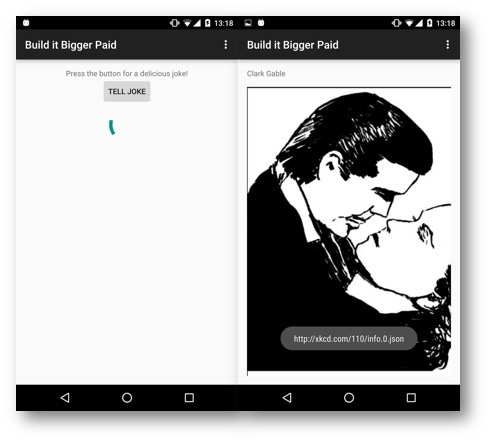

# BuildItBigger - Project 4 Android Nanodegree
* App retrieves jokes from Google Cloud Endpoints module and displays them via an Activity from the Android Library.

## Main features
* App has two flavors (free and paid).
* App has an Android Library which show jokes in a separate activity.
* Jokes supplied from GCE (from another Java library).
* Free version has ads (banner ad, interstitial ad).
* App has connected tests to check that data fetches from GCE correctly.
* Gradle build has a task, which starts local GCE, tests the app and shutdowns the GCE.

## Used technologies
* [Gradle, tasks.](https://github.com/dmytroKarataiev/BuildItBigger/blob/master/build.gradle)
* [Android Connected Tests.](https://github.com/dmytroKarataiev/BuildItBigger/blob/master/app/src/androidTest/java/com/udacity/gradle/builditbigger/ApplicationTest.java)
* [Google Ads API.](https://github.com/dmytroKarataiev/BuildItBigger/blob/master/app/src/free/java/com/udacity/gradle/builditbigger/MainActivityFragment.java)
* Addiditonal integrated [Java](https://github.com/dmytroKarataiev/BuildItBigger/blob/master/jokesprovider/src/main/java/com/example/JokesProvider.java) and [Android Libraries](https://github.com/dmytroKarataiev/BuildItBigger/blob/master/jokesactivity/src/main/java/com/adkdevelopment/jokesactivity/JokesActivityFragment.java).
* [Google Cloud Endpoints (both local and online).](https://github.com/dmytroKarataiev/BuildItBigger/tree/master/backend/src/main/java/com/example/karataev/myapplication/backend)

## Android Library
* Depending on the flavor of the app library either shows a not-so-funny joke, or downloads a comics from xkcd.
* Uses libraries: Picasso, GSON, OkHttp.

License
-------

	The MIT License (MIT)

	Copyright (c) 2016 Dmytro Karataiev

	Permission is hereby granted, free of charge, to any person obtaining a copy
	of this software and associated documentation files (the "Software"), to deal
	in the Software without restriction, including without limitation the rights
	to use, copy, modify, merge, publish, distribute, sublicense, and/or sell
	copies of the Software, and to permit persons to whom the Software is
	furnished to do so, subject to the following conditions:

	The above copyright notice and this permission notice shall be included in all
	copies or substantial portions of the Software.

	THE SOFTWARE IS PROVIDED "AS IS", WITHOUT WARRANTY OF ANY KIND, EXPRESS OR
	IMPLIED, INCLUDING BUT NOT LIMITED TO THE WARRANTIES OF MERCHANTABILITY,
	FITNESS FOR A PARTICULAR PURPOSE AND NONINFRINGEMENT. IN NO EVENT SHALL THE
	AUTHORS OR COPYRIGHT HOLDERS BE LIABLE FOR ANY CLAIM, DAMAGES OR OTHER
	LIABILITY, WHETHER IN AN ACTION OF CONTRACT, TORT OR OTHERWISE, ARISING FROM,
	OUT OF OR IN CONNECTION WITH THE SOFTWARE OR THE USE OR OTHER DEALINGS IN THE
	SOFTWARE.